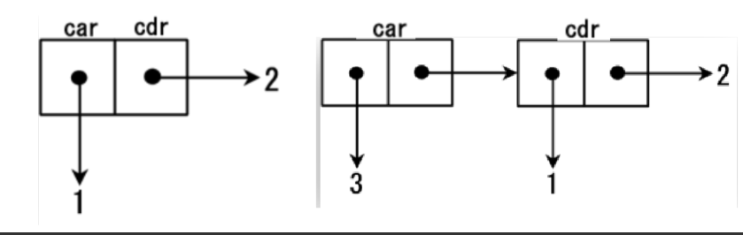
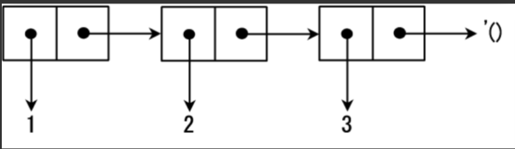

# Problem 018 - Scheme Interpreter

**ACMOJ Problem ID**: 2788

## Table of Contents

- [Problem 018 - Scheme Interpreter](#problem-018---scheme-interpreter)
  - [Table of Contents](#table-of-contents)
  - [Per-Testcase Resource Limits](#per-testcase-resource-limits)
  - [Overview](#overview)
  - [Project Framework](#project-framework)
  - [Tasks](#tasks)
  - [Implementation Requirements](#implementation-requirements)
  - [Submission Requirements](#submission-requirements)
    - [OJ Git Repository Compilation Process](#oj-git-repository-compilation-process)
    - [Git Configuration Requirements](#git-configuration-requirements)
    - [Submission Guidelines](#submission-guidelines)
    - [Grading Criteria](#grading-criteria)
    - [Evaluation Notes](#evaluation-notes)
    - [Academic Integrity](#academic-integrity)

## Per-Testcase Resource Limits

- **Time Limit (per test case)**: 1500 ms
- **Memory Limit (per test case)**: 244 MiB
- **Disk Usage**: Disk access is not permitted

## Overview

Please first read the [Interpreter Tutorial](https://notes.sjtu.edu.cn/pzbJsIoKQbSwt66MZR-vdQ). If you're interested, you can also read [Why Lisp is Superior](https://www.ruanyifeng.com/blog/2010/10/why_lisp_is_superior.html) :)

Simply put, you need to implement a `Scheme` interpreter. `Scheme` is a functional language with two main features:

- Uses S-expressions. Except for `Integer`, `Boolean` types and variable `var`, all other syntax is in the form `(expr exprs ...)`, for example `(+ 1 3)`
- Functions are also treated as variables

If you're interested in `Scheme`, you can find more information online, such as the [Scheme Extended Tutorial](https://joytsing.cn/posts/56075/#toc-heading-19). This assignment does not require you to implement all features of `Scheme`, so reading the documentation is sufficient to complete all requirements. The `Scheme` standards involved in this document are mainly `R5RS`, with some `R6RS` standards also included.

## Project Framework

### Compilation

We have provided `CMakeLists.txt` for you. To compile the entire project, enter the following in the root directory:

```bash
cmake -B build
cmake --build build --target code
```

After that, the `code` program will be generated in the subdirectory `bin`. Execute the following in the root directory:

```bash
./code
```

to run your interpreter.

### Code Implementation

Files under `src`:

```
src
├── shared.hpp
├── parser.cpp
├── evaluation.cpp
├── main.cpp
├── Def.hpp
├── Def.cpp
├── syntax.hpp
├── syntax.cpp
├── expr.hpp
├── expr.cpp
├── value.hpp
├── value.cpp
├── RE.hpp
├── RE.cpp
├── expr.hpp
└── expr.cpp
```

Among them, `parser.cpp` and `evaluation.cpp` are the main files you need to modify. For other files, their uses are as follows:

- `Def.hpp`: Declares the types, enumeration types, and auxiliary functions to be used
- `Def.cpp`: Defines auxiliary functions and two `map`s, where `primitive` is used to store keywords for `library` functions, and `reserved_words` stores keywords for other syntax
- `RE.hpp` and `RE.cpp`: Define exception types to be used when errors occur. You need to learn how to use exception types. See [here](https://www.runoob.com/cplusplus/cpp-exceptions-handling.html) for details
- `syntax.hpp` and `syntax.cpp`: Define all `Syntax` and subclasses. The specific implementation is in `syntax.cpp`
- `expr.hpp` and `expr.cpp`: Define all `Expr` and subclasses. Subclass constructors are in `expr.cpp`
- `value.hpp` and `value.cpp`: Define all `Value` and subclasses. Subclass constructors and output methods are in `value.cpp`. In addition, the scopes we mentioned are implemented in `Assoc` and `AssocList`. You can refer to these two files for details
- `main.cpp`: The execution part of the REPL

During the completion of this assignment, you can modify any related code. For example, when you handle `VoidV`, it is likely to involve modifications to `main.cpp`.

### Evaluation

We will provide some data to help you debug locally.

### Debugging

After completing the compilation, you can run your interpreter and input Scheme language yourself to check whether your interpreter behaves as expected.

At the same time, we provide an evaluation program in the `repo` for local evaluation of your interpreter. The evaluation program is in the subdirectory `score`, and the evaluation data is in the subdirectory `score/data`.

Specifically, the evaluation program will execute your interpreter and compare the results with the output of the standard program. To use the evaluation program, execute the following command in the subdirectory `score`:

```bash
./score.sh
```

If you don't have enough permissions, you can enter the following command and then execute it:

```bash
chmod +x score.sh
./score.sh
```

There are two lines in the script:

```bash
L = 1
R = 119
```

You can change these two variables to any numbers to evaluate test cases within the given range.

Please make reasonable use of the local evaluation program for debugging.

- This assignment does not need to consider memory leaks

## Tasks

This project is divided into two parts: `Basic` and `Extension`. For `Basic`, it is recommended to complete them in order because there are dependencies between different sections. You can only start `Extension` after completing ***all `Basic` parts***, and some `Extension` parts may require prerequisite `Extension` parts, as detailed below. For flexibility, you can choose which interpreter parts to complete. You can earn up to `125pts` in this section.

For smooth reading, the author explains by functionality. The division between `Basic` and `Extension` is detailed at the end. Please note the dependencies between functions.

---

### Subtask 1: Basic Arithmetic Operations and Comparison Operators

#### Task Overview

- `Basic`(`10pts`): Complete binary arithmetic and comparison operators supporting rational numbers and integer types, with expression nesting support
- `Extension`(`15pts`): Complete arithmetic and comparison operators with arbitrary parameters supporting rational numbers and integer types, with expression nesting support

Note: Don't worry about overflow issues, just use `int` uniformly

#### Involved Types

In this assignment, you will work with the following basic types:

| Expression  | Type         | Description                                                                                                 |
| ----------- | ------------ | ----------------------------------------------------------------------------------------------------------- |
| `Integer`   | Integer Type | Behaves like `int`, returns `#t` when checked with `number?`                                              |
| `Rational`  | Rational Type| N/A, returns `#f` when checked with `number?`                                                             |
| `Boolean`   | Boolean Type | Only has `#t` and `#f` results, corresponding to `true` and `false`, checked with `boolean?`             |
| `String`    | String Type  | Behaves like `string`, marked with `""` when input, checked with `string?`                               |
| `Symbol`    | Symbol Type  | Behaves like `enum`, treated as immutable string, checked with `symbol?`                                  |
| `Pair`      | Pair Type    | Can recursively store binary pairs to store lists, checked with `pair?`                                   |
| `Null`      | Null Type    | Empty list (`'()`), checked with `null?`                                                                  |
| `Terminate` | Terminate Type| Value type of `(exit)`                                                                                     |
| `Void`      | Void Type    | Represents all functions without side effects, including `(begin),(void),set!,display` etc. We require that except `(void)`, other commands do not output `#<void>` |
| `Procedure` | Function Type| Used to represent function closures, checked with `procedure?`                                            |

We have implemented all type handling and type checking for you. In `Subtask 1`, you will work with `Integer` and `Boolean`.

Type checking demo:

`(number? expr)`, `(boolean? expr)`, `(null? expr)`, `(pair? expr)`, `(symbol? expr)` respectively check whether the type of the value of `expr` is `Integer`, `Boolean`, `Null`, `Pair`, `Symbol`. They accept one parameter of any type, with the value being the corresponding result and type being `Boolean`.

`(eq? expr1 expr2)` checks whether the values of `expr1` and `expr2` are equal. This expression accepts two parameters of any type, with the value being the corresponding result and type being `Boolean`. Specific comparison rules:

- If both parameters are of type `Integer`, compare whether the corresponding integers are the same
- If both parameters are of type `Boolean`, compare whether the corresponding boolean values are the same
- If both parameters are of type `Symbol`, compare whether the corresponding strings are the same
- If both parameters are of type `Null` or both are of type `Void`, the value is `#t`
- Otherwise, compare whether the memory locations pointed to by the two values are the same (for example, two `Pair`s, even if their left and right values are equal, if the memory locations are different, we still consider them different)

The interface we provide stores pointers to values rather than the values themselves. You can define `Value v` and use `v.get()` to view the memory location pointed to by `v`.

Example:

```scheme
scm> (not #f)
#t
scm> (not (void))
#f
scm> (pair? (car (cons 1 2)))
#f
scm> (symbol? (quote var))
#t
scm> (number? (+ 5 1))
#t
scm> (null? (quote ()))
#t
scm> (eq? 3 (+ 1 2))
#t
scm> (eq? #t (= 0 0))
#t
scm> (eq? (quote ()) (quote ()))
#t
scm> (eq? (quote (1 2 3)) (quote (1 2 3)))
#f
scm> (define str "hello")
scm> (eq? str str)
#t
scm> (eq? "hello" "hello")
#f
scm> (eq? 1 1)
#t
```

#### Basic Arithmetic Operations

In real `Scheme`, `+`, `-`, `*`, and `/` represent addition, subtraction, multiplication, and division respectively, and accept both integer and fraction processing. If there are fractions in the input parameters, the result is represented as the simplest fraction or integer form; for example:

```scheme
(- 10 3)    ;->7
(* 2 3)     ;->6
(/ 29 3)    ;->29/3
(/ 9 6)     ;->3/2
(/ 1 0)     ;->RuntimeError
(+ 1/2 1)   ;->3/2
```

Parentheses can be nested like this:

```scheme
(* (+ 2 3) (- 5 3)) ;-> 10
(/ (+ 9 1) (+ 2 3)) ;-> 2
(+ (/ 1 2) (+ 1 1)) ;->5/2
```

Also supports arbitrary number of parameters:

```scheme
;;0 parameter: (+) → 0;(*) → 1;(-)→ RuntimeError;(/)→ RuntimeError
;;1 parameter: (+ x) → x;(* x) → x;(- x) → -x;(/ x) → 1/x
;;2 parameter: also right;
;;more parameters:
(+ 2 3 4) ;-> 9
(- 2 3 4) ;-> -5
(* 2 3 4) ;-> 24
(/ 2 3 4) ;-> 1/6
```

Note that `+`, `-`, `*`, and `/` here are actually functions; `modulo` and `expt` are already provided in `evaluation.cpp` for reference on binary function implementation; the implementation of the fraction class can be found in the `Rational` class, and the implementation of arbitrary parameters can be found in the `Variadic` class.

#### Comparison Operators

In real `Scheme`, `>`, `>=`, `<`, `<=`, and `=` are not only binary, but should also support two or more parameters. When the input parameters are sorted according to the function name, it returns `#t`, otherwise it returns `#f`;

```scheme
(= 1 1)      ;Value: #t 
(< 1 2)      ;Value: #t 
(= 2 2 2)      ;Value: #t 
(< 2 3 4)      ;Value: #t 
(> 4 1 -1)     ;Value: #t 
(<= 1 1 1)     ;Value: #t 
(>= 2 1 1)     ;Value: #t 
```

We have provided `modulo` and `expt` in `evaluation.cpp` for reference on binary function implementation; the implementation of the fraction class can be found in the `Rational` class, and the implementation of arbitrary parameters can be found in the `Variadic` class; we also provide the `compareNumericValues` function to help you quickly compare rational numbers and integers, of course you can also choose to implement them yourself :)

----

### Subtask 2: Tuples and Lists

#### Task Overview

- `Basic`(`10 pts`): Complete handling of basic tuple and list commands (`cons`, `car`, `cdr`); correctly implement `quote` command handling;
- `Extension`(`10 pts`): Complete `list` and `list?` commands; complete `set-car!` and `set-cdr!`, this part is explained in the `set!` section in `Subtask5` later;

#### Involved Types

In `Subtask 2`, you will work with all types except `Procedure`.

#### Tuples and Lists

In `Scheme`, we use the form `(A . B)` to represent a binary pair; such binary pairs are generally generated through the form `(cons A B)`; for example, the following figures represent `(cons 1 2)` and `(cons 3 (cons 1 2))` respectively. The head and tail of each binary pair are represented by `car` and `cdr`.



Of course, the types of `A` and `B` in `(cons A B)` can be completely different, and commands can also be nested:

```scheme
(cons 'a (cons 3 "hello"))
;;Value : (a 3 . "hello")
(cons (cons 0 1) (cons 2 3))
;;Value : ((0 . 1) 2 . 3)
;;THINKING: WHY NOT (0 1 2 . 3)?
```

Through nested commands, we can easily see that we can implement lists through nesting `cons`, for example, the following figure shows the implementation of list `(1 2 3)`;



It can be seen that its essence is a `Pair` chain recursively constructed from `'()`.

In addition, we require support for some commands:

#### Basic Commands

The `car` and `cdr` functions are used to return the `car` and `cdr` parts of a `Cons` unit. If the `cdr` part is connected to a `Cons` unit, the interpreter will print the entire `cdr` part until the last element;

```scheme
(car '(1 2 3 4))
;Value: 1
(cdr '(1 2 3 4))
;Value: (2 3 4)
(car (cons 5 #f))
;;Value: 5
(cdr (cons #t (void)))
;;Value: #<void>
(cdr (quote ((ll . lr) . (rl . rr))))
;;Value: (rl . rr)
(car (quote (+ - *)))
;;Value: +
```

The `list` function allows us to build lists containing several elements. It supports any number of parameters and returns a list composed of these parameters; the `list?` function is used to determine whether it is a `list`, note the special case of `'()`.

```scheme
(list)
;Value: ()
(list 1)
;Value: (1)
(list '(1 2) '(3 4))
;Value: ((1 2) (3 4))
(list 0)
;Value: (0)
(list 1 2)
;Value: (1 2)
(list? '())
;Value: #t
(list? '(1 2 3))
;Value: #t
(list? '(1 2 3))
;Value: #t
(pair? '())
;Value: #f
(list? (cons 1 2))            
;Value: #f
(list? (cons 1 (cons 2 '()))) 
;Value: #t
```

#### Quote (`quote`)

In `Scheme`, all symbols are evaluated from the innermost parentheses to the outermost parentheses, and the value returned by the outermost parentheses will serve as the value of the S-expression. But the form called quote (`quote`) can be used to prevent symbols from being evaluated. It is used to pass symbols or lists intact to the program, rather than becoming something else after evaluation. For example, `(+ 2 3)` will be evaluated to `5`, but `(quote (+ 2 3))` returns `(+ 2 3)` itself to the program. Because `quote` is used very frequently, it is abbreviated as `'`.

For example:

```scheme
;;'(+ 2 3) represents the list `(+ 2 3)` itself;
;;'+ represents the symbol `+` itself;
;;'() is a reference to the empty list, that is, although the interpreter returns `()` to represent the empty list, you should use `'()` to represent the empty list

(quote 1)         ;;1 // Integer 
(quote #t)        ;;#t // Boolean 
(quote (+ 1 2 3)) ;;(+ 1 2 3) // List
(quote (4 . 5))   ;;(4 . 5) // Pair
(quote scheme)    ;;scheme // Symbol 
```

We require that if the object of `quote` is a `Pair`, we require its output form to satisfy the form `(A B . C)`, that is:
- The dot symbol can only appear once
- The dot symbol must be in the penultimate position
- `(a . b . c)` is illegal
- `(a .)` is illegal

This part may not be easy to understand, you can think with the help of the following examples:

```scheme
(quote (1 2 . 3))                     ;;Value:(1 2 . 3)
(quote (1 2 3))                       ;;Value:(1 2 3)
(quote (1 . (2 . 3)))                 ;;Value:(1 2 . 3)
(quote (1 . (2 . (3 . ()))))          ;;Value:(1 2 3)
(quote (quote (1 2)))                 ;;Value:(quote (1 2))
(car (quote ((1 . 2) 3 . 4)))         ;;Value:(1 . 2)
(cdr (quote ((1 . 2 ) 3 . 4)))        ;;Value:(3 . 4)
(quote (quote () 1 2 . (4 . 2)))      ;;Value:(quote () 1 2 4 . 2)
(car (quote (quote () 1 2 . (4 . 2))));;Value:quote
(cdr (quote (quote () 1 2 . (4 . 2))));;Value:(() 1 2 4 . 2)
```

----

### Subtask 3: Sequential Execution, Boolean Value Processing and Conditional Statements

#### Task Overview

- `Basic`(`15 pts`): Complete handling of sequential execution commands (`begin`); correctly implement handling of logical operators (`and`,`or`,`not`) commands; correctly implement conditional statements (`if`) statement;
- `Extension`(`5 pts`): Correctly implement `cond` statement.

#### Involved Types

In `Subtask 3`, you will work with all types except `Procedure`, mainly working with `Boolean` type.

#### Boolean Operators

The operators involved here are `not`, `and` and `or`.

`not` is a unary operator, in the format `(not expr)`, which negates after evaluating the expression in `expr`; behaves the same as `not` in `C++`;

`and` has an arbitrary number of parameters and evaluates them from left to right. If a parameter is `#f`, then it returns `#f` without evaluating the remaining parameters. Conversely, if all parameters are not `#f`, then it returns the value of the last parameter.

`or` has a variable number of parameters and evaluates them from left to right. It returns the first parameter that is not the value `#f`, and the remaining parameters will not be evaluated. If all parameters have the value `#f`, the value of the last parameter is returned.

Please note that in `scheme`, any value different from `#f` (including values of different types, including `'()`) will be treated as `#t`.

Please note that both `and` and `or` have short-circuit properties, that is, after encountering a boolean expression that meets the requirements, if there are illegal expressions after it, there is no need to report an error. That is, expressions like `(and #f (/ 1 0))` are legal.

```scheme
(not (> 1 2))
;;Value: #t
(not (< 1 2))
;;Value: #f
(not 5)
;;Value: #f
(and)
;Value: #t
(and 1 2 3)
;Value: 3
(and 1 2 3 #f)
;Value: #f
(or)
;Value: #f
(or 1 2 3)
;Value: 1
(or #f 1 2 3)
;Value: 1
(or #f #f #f)
;Value: #f
```

#### `if` Statement

In `scheme`, the format of the `if` statement is as follows:

```scheme
(if predicate then_value else_value)
```

If the `predicate` part is true, then the `then_value` part is evaluated, otherwise the `else_value` part is evaluated, and the evaluated value will be returned to the outside of the parentheses of the `if` statement. Please note that in `scheme`, any value different from `#f` (including values of different types, including `'()`) will be treated as `#t`.

Please note that `if` has short-circuit properties, if the branch it does not evaluate involves illegal expressions, there is no need to report an error.

```scheme
(if 0 1 2)
;;Value: 1
(if (< 2 1) #f #t)
;;Value: #t
(if (void) undefined 1)
;;Value: RuntimeError
(if #f undefined 1)
;;Value: 1
(if #t 1 (+ 1))
;;Value: 1
(if "hello" 1 2)
;;Value: 1
(if #t 'true-branch (/ 1 0))
;;Value: true-branch
(if #f (/ 1 0) 'false-branch)
;;Value: false-branch
```

#### `cond` Statement

Similar to `switch-case`, the `cond` statement is used to simplify nested if expressions, in the following format:

```scheme
(cond
  (predicate_1 clauses_1)
  (predicate_2 clauses_2)
    ......
  (predicate_n clauses_n)
  (else        clauses_else))
```

In the `cond` expression, `predicates_i` are evaluated in order from top to bottom, and when `predicates_i` is true, `clause_i` will be evaluated and returned. `predicates` and `clauses` after `i` will not be evaluated. If all `predicates_i` are false, then `clause_else` is returned. In a clause, you can write several expressions, and the value of `clause` is the last expression (note that `cond` also follows the short-circuit evaluation characteristic); in particular, if there is no matching branch, then return `VoidV()`; if for a single condition branch there is only a condition without a branch (such as `(cond (#t))`), then return the condition value; for example, `(cond (else 1) (#t 2))` outputs `1`;

#### `begin` Statement

`(begin expr*)` represents the sequential structure in `scheme`, `expr*` indicates that there may be `0,1,2,⋯` `expr`s. You need to execute `expr` from left to right in sequence, and the value of `(begin expr*)` is the value of the rightmost `expr`, note that these `expr`s may contain illegal situations.

```scheme
(begin 1)
;;Value: 1
(begin (void) (cons 1 2) #t)
;;Value: #t
```

----

### Subtask 4: Variables and Functions

#### Task Overview

- `Basic`(`20 pts`): Complete handling of `var` command; complete handling of `lambda` command for function declaration; complete basic definition of variables and functions with `define` and unary recursion handling;
- `Extension`(`10 pts`): Implement nested definitions and lexical closures, this part depends on the introduction of assignment statements, so the introduction is placed at the end of `Subtask 5`.

#### Involved Types

In `Subtask 4`, you will work with the `Procedure` type, this part will be quite difficult to understand, please read this section carefully and the previous section "Interpreter Tutorial".

#### Variables (`var`)

In this section, we assume that any `SymbolSyntax` can be interpreted as `var`, including strings in `primitives` and `reserve_words`, for example, `+` and `quote` can also be variable names (note that this is only limited to `Var::eval()`, the requirements for `Define` and variable binding later are different); here we require:

1. Variable names can contain uppercase and lowercase letters (`Scheme` is case-sensitive), numbers, and characters in `?!.+-*/<=>:$%&_~@`. In this assignment, we stipulate:
2. The first character of a variable name cannot be a number or `.@`
3. If a string can be recognized as a number, then it will be recognized as a number first, for example `1、-1、+123`
4. When the variable is undefined in the current scope, your interpreter should output `RuntimeError`
5. Variable names can overlap with `primitives` and `reserve_words`
6. Characters in variable names can be any non-whitespace characters except `#`, `'`, `"`, ` but the first character cannot be a number

```scheme
undefined ;;Value: undefined variable is undefined in the current scope
;;Value: RuntimeError
+ ;;Value: + as a primitive, is a function
;;Value: #<procedure>
((if #t + -) 1 2) ;;Value: (if #t + -) evaluates to +, then call for function call
;;Value: 3
```

#### Function Declaration and Invocation

In `scheme`, functions are declared with the `lambda` statement, in the format `(lambda parameters procedure)`, the specific output is to return a `ProcedureV(parameters,e,env)` closure, which constitutes a function declaration, such as:

```scheme
(lambda (x y) (+ x y))
;;Value: #<procedure>
(lambda () (void))
;;Value: #<procedure>
(lambda (void) undefined)
;;Value: #<procedure>
```

But this only constitutes a declaration, not a call;

We require you to support the new syntax `((lambda (arg1....argn) procedure) var1....varn)`, you need to pass `var1....varn` into `arg1....argn` and substitute into `procedure` for evaluation: for example:

```scheme
(((lambda (+) +) *) 2 3)
;;Value: 6
((lambda (x y) (* x y)) 10 11)
;;Value: 110
```

Note that if `procedure` contains multiple expressions here, you need to execute them from left to right in sequence.

#### Variable and Function Definition

In `Scheme`, use `define` to bind a symbol to a value. You can bind any type such as numbers, characters, tables, functions through this operator.

```scheme
; Hello world as a variable
(define vhello "Hello world")     

; Hello world as a function
(define fhello (lambda ()         
         "Hello world"))
```

`define` accepts two parameters, it will use the first parameter as a global parameter and bind it to the second parameter. Therefore, in line 1 of code snippet 1, we declare a global parameter `vhello` and bind it to `"Hello, World"`; then, in line 2, we declare a procedure that returns `"Hello World"`.

Entering `vhello` in the interpreter, the interpreter returns `"Hello, World"`; if you enter `fhello` in the interpreter, it returns `#<procedure>`; if you treat `fhello` as a procedure, you should enclose these symbols in parentheses, such as `(fhello)`, then evaluate and return `"Hello World"`.

Simply put, you need to support:

1. Variable definition; the requirements are the same as `var`, and are not allowed to overlap with `primitives` and `reserve_words`; and support renaming of the same variable;
 
2. Simple function definition, required to support the following syntax form:
 
 ```scheme
 (define sum3 (lambda (a b c)(+ a b c)))
 ```
 
 And its abbreviated form:
 
 ```scheme
 (define (sum3 a b c)
   (+ a b c))
 ```

3. Handling of unary simple recursive functions; for this, you need to first create a placeholder binding in the environment, then calculate the value of the expression, and finally update the binding to the actual value

```scheme
(define (fact n)
  (if (= n 1)
      1
      (* n (fact (- n 1)))))
```

Recursion is commonly used in `Scheme` to represent repetition; lists are recursively defined, and thus lists and recursive functions can work well together. For example, a function that doubles all elements in a list can be written as follows. If the parameter is an empty list, then the function should stop calculating and return an empty list.

```scheme
(define (list*2 ls)
  (if (null? ls)
      '()
      (cons (* 2 (car ls))
             (list*2 (cdr ls)))))
```

In the above process, we ensure that all `define`s are in the global environment; there will be no situation where `define` is nested in `begin`, `define`, `let` etc. that may create a local environment.

Note that if the second parameter contains multiple expressions here, you need to execute them from left to right in sequence.

----

### Subtask 5: Variable Binding and Assignment

#### Task Overview

This part is all `Extension`, including:
- `let` and `letrec`(`20pts`)
- `set!`(`10pts`)
- Introduction to `set-car!` and `set-cdr!` in `Subtask 2`, introduction to nested definitions and lexical closures in `Subtask 4`.

#### Involved Types

In `Subtask 5`, you will work with all types, this part will be quite difficult to understand, please read this section carefully and the previous section "Interpreter Tutorial".

#### `let` Expression

In `Scheme`, the `let` expression can be used to define local variables. The format is as follows:

```scheme
(let ((p1 v1) (p2 v2) ...) body)
```

In this process, variables `p1、p2、...` are declared and assigned initial values `v1、v2、...` respectively (`v1 v2...` can be expressions); `body` consists of any number of S-expressions. The scope of variables is `body`. The result of the `let` expression is to evaluate the expressions in `body` within `body`; note that if `body` contains multiple expressions here, you need to execute them from left to right in sequence.

Essentially,

```scheme
(let ((p1 v1) (p2 v2) ...) body)
```

is just syntactic sugar for

```scheme
((lambda (p1 p2 ...) body) v1 v2 ...)
```

For example:

Example 1: Declare local variables `i` and `j`, bind them to `1、2`, then find their sum.

```scheme
(let ((i 1) (j 2)) (+ i j))
;Value: 3
```

`let` expressions can be nested.

Example 2: Declare local variables `i` and `j`, and bind them to `1` and `i+2` respectively, then find their product.

```scheme
(let ((i 1))
  (let ((j (+ i 2)))
    (* i j)))
;Value: 3
```

Since the scope of variables is only in `body`, the following code will produce an error because there is no definition of variable `i` in the scope of variable `j`.

```scheme
(let ((i 1) (j (+ i 2)))(* i j))
;;Error
```

Example 3: You should correctly implement variable coverage in inner and outer layers, for example, the following expression should output `inner` instead of `outer`.

```scheme
(let ((x (quote inner)))
	(let ((func (lambda () x)))
      	(let ((x (quote outer))) (func))))
;;Value: inner
```

Example 4: The variable binding here is the same as the `var` requirement, supporting `primitives` and `reserved_words`;

```scheme
(let ((+ 1)) +)
;;Value: 1
(let ((+ -)) (+ 2 1))
;;Value: 1
(let ((+ 1)) +) ;;Value: + in the scope within let is a variable, its corresponding value is 1
;;Value: 1
(let ((x (lambda (y) y))) x)
;;Value: #<procedure>
```

#### `letrec` Expression

`letrec` is similar to `let`, but it allows a name to recursively call itself. The syntax letrec is usually used to define complex recursive functions. The following shows the `letrec` version of the `fact` function.

We try to implement a recursive function `fact` that calculates factorials using `let` syntax:

```scheme
(let
	((fact
      	(lambda (n)
          	(if (= n 0)
				1
                (* n (fact (- n 1)))))))
	(fact 5))
```

Considering the scope inside the `fact` `Closure`, we can find that this scope does not include `fact`, so the above expression will get `RuntimeError`.

This is the deficiency of `let` syntax, it does not support us calling other `var` when evaluating the value of `var`.

Let's see how `letrec` solves this problem: first create a new scope `env1` based on the current scope, bind `var*` to `Value(nullptr)` (indicating that the variable is defined but cannot be used) and introduce it into `env1`; then evaluate `expr*` under `env1`, and create a new scope `env2` based on `env1`, bind `var*` to their corresponding values and introduce them into `env2`; finally evaluate `expr*` under `env2`, and update the variable bindings in `env2`, evaluate `expr` in `env2`.

You may wonder what is the difference between "defining the variable but cannot use" and not defining this variable, indeed, in this case

```scheme
(letrec
	((a 1)
     (b a))
	b)
```

it doesn't work, because although variable `a` is defined but cannot be used, your interpreter should still output `RuntimeError`. But what if `b` is bound to a `Closure`? For example

```scheme
(letrec
	((a 1)
     (b (lambda () a)))
	(b))
```

, at this time your interpreter should output `1`. Because `(lambda () a)` is a `Closure`, we will not execute and evaluate its function body `a` when defining it, so the interpreter will not report an error; and when we really evaluate `a`, the scope `env2` we are in has the value of variable `a` as `1`, so there is no problem.

In this case, the `letrec` implemented `fact` is:

```scheme
(letrec ((fact (lambda (n) 
                 (if (<= n 1) 1 
                     (* n (fact (- n 1)))))))
  (fact 5))
```

The syntax `letrec` is the conventional way to define local variables.

#### Assignment (`set!`,`set-car!`,`set-cdr!`)

Because `Scheme` is a functional language, usually, you can write statements without using assignment. However, if you use assignment, some algorithms can be easily implemented. Although assignment is very common and easy to understand, it has some essential flaws.

In particular, in `Scheme`, because assignment changes the value of the parameter, it is destructive, so it ends with `!` to warn programmers. In this assignment, you need to implement `set!`, `set-car!` and `set-cdr!`.

`set!` can assign a value to a parameter, and the parameter should be defined before assignment.

```scheme
(define var 1)
(set! var (* var 10))
;;var ⇒ 10

(let ((i 1))
    (set! i (+ i 3))
    i)
;;⇒ 4
```

Functions `set-car!` and `set-cdr!` assign new values to the `car` part and `cdr` part of a `cons` unit respectively; unlike `set!`, these two operations can assign values to S-expressions.

```scheme
(define tree '((1 2) (3 4 5) (6 7 8 9)))

(set-car! (car tree) 100)  ; changing 1 to 100 

tree
;;Value: ((100 2) (3 4 5) (6 a b c))
```

#### Implementation of Nested Definitions
 
The implementation of unary recursion is simple, now we hope you can implement nested definitions as shown below:
 
```scheme
(define (is-even n)
  (cond
   ((= n 0) #t)
   (else (is-odd (- n 1)))))

(define (is-odd n)
  (cond
   ((= n 0) #f)
   (else (is-even (- n 1)))))
```

#### Implementation of Lexical Closures

You can use lexical closures to implement procedures with internal state. For example, a procedure used to simulate a bank account can be written as follows: the initial capital is `10` dollars. The function receives an integer parameter. Positive numbers indicate deposit, negative numbers indicate withdrawal. For simplicity, negative deposits are allowed here.

```scheme
(define bank-account
  (let ((balance 10))
    (lambda (n)
      (set! balance (+ balance n))
      balance)))
```

This procedure assigns the deposit to `(+ balance n)`. Below are the results of calling this procedure.

```scheme
(bank-account 20)     ; donating 20 dollars 
;Value: 30
(bank-account -25)     ; withdrawing 25 dollars
;Value: 5
```

Because in `Scheme`, you can write procedures that return procedures, you can write a function that creates bank accounts. This example indicates that using functional programming languages can easily implement object-oriented programming languages. In fact, you only need to add a little more on this basis to implement an object-oriented programming language.

```scheme
(define (make-bank-account balance)
  (lambda (n)
    (set! balance (+ balance n))
    balance))
(define gates-bank-account (make-bank-account 10))   ; Gates makes a bank account by donating  10 dollars
;Value: gates-bank-account

(gates-bank-account 50)                              ; donating 50 dollars
;Value: 60

(gates-bank-account -55)                             ; withdrawing 55 dollars
;Value: 5


(define torvalds-bank-account (make-bank-account 100))  ; Torvalds makes a bank account by donating 100 dollars
;Value: torvalds-bank-account

(torvalds-bank-account -70)                             ; withdrawing 70 dollars
;Value: 30

(torvalds-bank-account 300)                             ; donating 300 dollars
;Value: 330
```

## Implementation Requirements

In summary, the `Basic` and `Extension` tasks you need to complete are:

| `Basic/Extension` | Syntax Form                 | Requirements                                                        | Points  |
| ----------------- | --------------------------- | ------------------------------------------------------------------- | ------- |
| `Basic`           | Arithmetic & Relation Ops   | Binary, supports nesting, supports integer and rational number types | `10pts` |
| `Basic`           | `quote`                     | See above                                                           | `5pts`  |
| `Basic`           | Tuples & Pairs              | Support `pair`,`cons`,`car`,`cdr`                                   | `5pts`  |
| `Basic`           | `begin`                     | Support sequential execution, see above for details                 | `5pts`  |
| `Basic`           | Boolean Related             | `and`,`or`,`not`,`if`                                               | `10pts` |
| `Basic`           | Variable & Function Decl    | `var`,`lambda`,`Apply`                                              | `10pts` |
| `Basic`           | `Define`                    | Basic variable & function declaration, unary recursion, no nesting  | `10pts` |
| `Extension`       | Arithmetic & Relation Ops   | Arbitrary parameters, supports nesting, integer & rational types    | `15pts` |
| `Extension`       | Lists                       | `list`,`list?`                                                      | `5pts`  |
| `Extension`       | List Element Assignment     | `set-car!`,`set-cdr!`                                               | `5pts`  |
| `Extension`       | Multi-way Conditional       | `cond`                                                              | `5pts`  |
| `Extension`       | `Define`                    | Support nested definitions, lexical closures                        | `10pts` |
| `Extension`       | Variable Binding            | `let`,`letrec`                                                      | `20pts` |
| `Extension`       | Variable Assignment         | `set!`                                                              | `10pts` |

## Submission Requirements

### OJ Git Repository Compilation Process

For Git compilation, we will first clone the repository using a command similar to:

```bash
git clone <repo_url> . --depth 1 --recurse-submodules --shallow-submodules --no-local
```

Then we check if there is a `CMakeLists.txt` file. If it exists, we run (if not, a warning message will be displayed):

```bash
cmake .
```

Finally, we check if there is any of `GNUmakefile`/`makefile`/`Makefile` (if cmake was run previously, this will be the generated Makefile). If it exists, we run (if not, a warning message will be displayed):

```bash
make
```

After this process is complete, we will use the `code` file in the project root directory as the compilation result.

A `CMakeLists.txt` file is provided in the project. You can use or modify it as needed. The local environment has gcc-13 and g++-13 available.

### Git Configuration Requirements

**IMPORTANT**: You must create a `.gitignore` file in your project root directory to avoid OJ evaluation conflicts.

The `.gitignore` file should include at least the following entries:

```gitignore
CMakeFiles/
CMakeCache.txt
```

### Submission Guidelines

- The submitted code must be able to compile successfully through the above compilation process
- The compiled executable file name must be `code`
- The program needs to be able to read data from standard input and write results to standard output
- Please ensure the code runs correctly within the given time and space limits
- **You must use C++ language** to implement this assignment

### Grading Criteria

- **OJ Score**: 80% (OJ maximum 125 points, normalized to 0-80)
- **Code Review**: 20%
- **Total**: 100 points

### Evaluation Notes

- The evaluation system will test your program using the provided test data
- The program output must exactly match the expected output (including format)
- Exceeding time or memory limits will be judged as the corresponding error type
- Please pay attention to the overall time performance of your code and the time complexity of each part of your algorithm

### Academic Integrity

If any violations are found during evaluation or code review (including but not limited to using unconventional methods to pass test cases), your final score may be significantly reduced or become **0 points**.